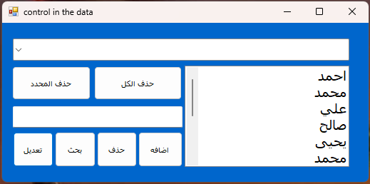
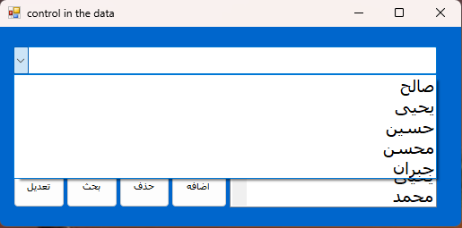
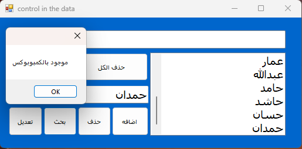
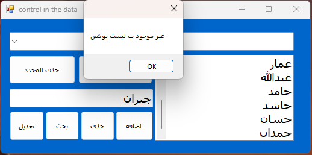

# control in the data

🎯 تطبيق سطح مكتب بلغة #C يتيح للمستخدم إدارة البيانات (إضافة - عرض - تعديل - حذف) باستخدام ComboBox و ListBox بطرق فردية وجماعية.

---

## 🧰 مميزات المشروع

- ➕ إضافة بيانات جديدة إلى القائمة
- 🗂️ عرض البيانات الحالية داخل ComboBox و ListBox
- ✏️ تعديل عنصر محدد داخل القائمة
- 🗑️ حذف عنصر محدد أو حذف جميع البيانات دفعة واحدة
- ✅ دعم العمليات الفردية والجماعية بسهولة
- 🔄 تزامن بين ComboBox و ListBox

---

## 🖼️ صور من واجهة البرنامج

### ✅ الواجهة الرئيسية

### ➕ عرض البيانات

### ✏️ بحث عن بيانات

### 🗑️ بحث عن بيانات

---

## 🚀 كيفية التشغيل

1. افتح المشروع باستخدام **Visual Studio**.
2. قم بتشغيل الملف `Form1.cs` أو الملف الرئيسي.
3. استخدم الواجهة لإجراء عمليات التحكم في البيانات.

---

## 🧑‍💻 المطور

**الاسم:** malsalimi  
**GitHub:** [https://github.com/malsalimi](https://github.com/malsalimi)

---

## ⚖️ الرخصة

هذا المشروع مجاني لأغراض التعلم والتعليم فقط.
